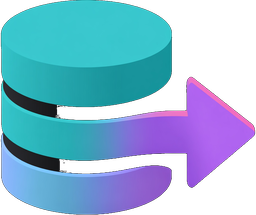
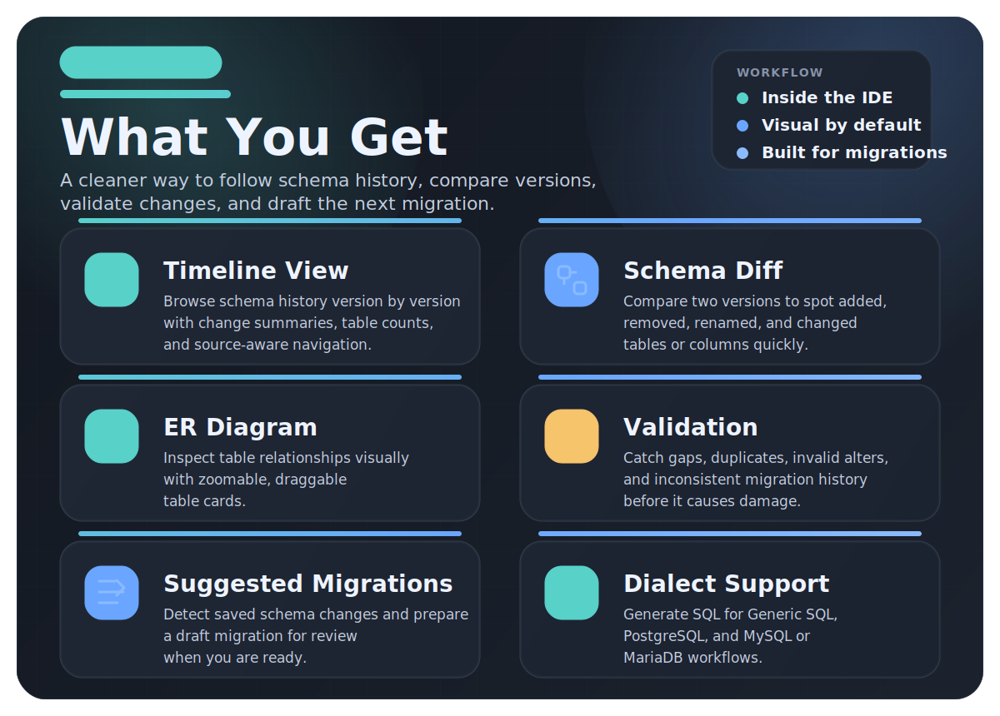

# SQL Migration Visualizer

<p align="center">
  
</p>

<p align="center">
  <strong>See your database history inside IntelliJ IDEA.</strong>
</p>

<p align="center">
  Explore schema evolution, compare versions, validate migrations, and draft the next SQL migration without bouncing between folders and files.
</p>

<p align="center">
  
  
  
  
</p>

## Why It Feels Useful

SQL migrations often live in a messy gap between schema files, versioned scripts, and whatever context still exists in your head. This plugin turns that history into something you can browse and reason about directly inside the IDE.

Instead of piecing everything together manually, you can:

- follow how a table changed over time
- compare two schema versions side by side
- inspect relationships visually in an ER diagram
- validate migration history before problems reach runtime
- generate a draft for the next migration after schema changes
- see a risk score before applying a migration (drops, missing defaults, type narrowing)

## What You Get

<p align="center">
  
</p>

The plugin keeps the full migration workflow in one place: browse history, compare versions, inspect relationships, validate drift, and draft the next migration without bouncing between folders, SQL files, and mental notes.

## Ideal For

- SQLDelight-based projects
- teams using versioned `.sql` or `.sqm` migrations
- projects with baseline schema files that drift over time
- developers who want migration history to be reviewable instead of tribal knowledge

## Supported Layouts

The plugin auto-detects common migration and schema locations such as:

- `src/main/sqldelight`
- `src/commonMain/sqldelight`
- `src/androidMain/sqldelight`
- `db/migrations`
- `database/migrations`
- `migrations`
- `src/main/resources/db/migrations`
- `src/main/resources/schema`

It also recognizes common naming patterns like:

- `1.sql`
- `2.sqm`
- `12_add_users.sql`
- `V3__create_orders.sql`

## Visual Preview

The README is ready for real screenshots, but I have not added fake UI mockups here. Once you capture the timeline, diff, and ER views from the plugin, this section is the right place to showcase them.

Suggested screenshots to add later:

- timeline view with version history
- schema diff comparison
- ER diagram canvas
- pending migration suggestion banner

## Local Development

Requirements:

- JDK 17
- IntelliJ Platform `2024.1`

Useful commands:

```bash
./gradlew test
./gradlew runIde
./gradlew build
```

## Project Status

Current version: `1.0.0`

This repository contains the source for the IntelliJ plugin. If you want to build, test, or iterate on the plugin locally, the Gradle tasks above are the quickest path in.

## License

Licensed under the GNU General Public License v3.0.
See [LICENSE](LICENSE).
