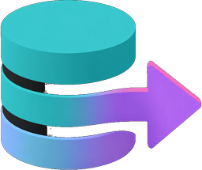
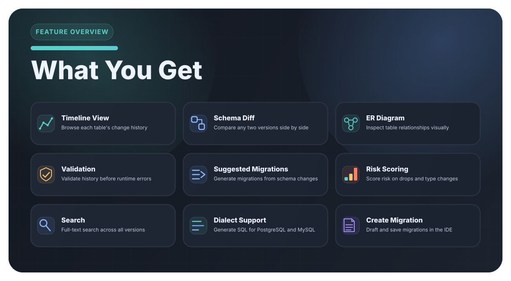

# SQL Migration Visualizer

<p align="center">
  
</p>

<p align="center">
  <strong>See your database history inside IntelliJ IDEA.</strong>
</p>

<p align="center">
  Explore schema evolution, compare versions, validate migrations, and draft the next SQL migration without bouncing between folders and files.
</p>

<p align="center">
  <a href="https://jakubn11.github.io/sql-migration-visualizer/"><strong>🌐 Website &amp; live demo</strong></a>
</p>

<p align="center">
  
  
  
  
</p>

## What You Get

<p align="center">
  
</p>

## Ideal For

- SQLDelight-based projects
- teams using versioned `.sql` or `.sqm` migrations
- projects with baseline schema files that drift over time
- developers who want migration history to be reviewable instead of tribal knowledge

## Generator Dialects

| Dialect | Notes |
|---------|-------|
| Generic SQL | Lowest-common-denominator output; falls back to table rebuilds for any column modification |
| PostgreSQL | Emits `ALTER COLUMN ... TYPE / SET NOT NULL / SET DEFAULT` for in-place changes |
| MySQL / MariaDB | Emits `MODIFY COLUMN` / `CHANGE COLUMN` for in-place changes and renames |
| SQLite | Wraps complex column changes in the standard 12-step rebuild with `PRAGMA foreign_keys` guards |

## Installation

See [INSTALL.md](INSTALL.md) for full instructions.

Build from source:
```bash
./gradlew buildPlugin
```
Then install the ZIP via **Settings → Plugins → ⚙ → Install Plugin from Disk**.

## Supported Layouts

The plugin auto-detects common migration and schema locations:

| Directory |
|-----------|
| `src/main/sqldelight` |
| `src/commonMain/sqldelight` |
| `src/androidMain/sqldelight` |
| `src/jvmMain/sqldelight` |
| `src/iosMain/sqldelight` |
| `db/migrations` · `database/migrations` · `migrations` |
| `src/main/resources/db/migration` · `src/main/resources/db/migrations` |
| `src/main/resources/migrations` · `src/main/resources/sql` |
| `src/main/resources/schema` |

Recognised file naming patterns:

| Pattern | Example |
|---------|---------|
| Plain version | `1.sql`, `2.sqm` |
| Version + name | `12_add_users.sql` |
| Flyway | `V3__create_orders.sql` |

## Usage

Open the **SQL Migrations** panel at the bottom of the IDE. The plugin scans your project on open and after every file save.

**Create Migration dialog:**

| Key | Action |
|-----|--------|
| Cmd+Enter / Ctrl+Enter | Submit the migration (create or save) |
| Tab | Accept the selected SQL autocomplete suggestion |
| ↑ / ↓ | Navigate autocomplete suggestions |
| Esc | Close autocomplete, or close the dialog (with a confirmation if there are unsaved SQL statements) |

## Troubleshooting

| Symptom | Fix |
|---------|-----|
| No migrations appear | Check that your migration directory matches one of the supported layouts, or set it manually in **Settings → Tools → SQL Migration Visualizer**. |
| Timeline shows gaps | Versions must be contiguous integers. Run **Validate** to see the exact gap locations. |
| Two migrations have the same version | Open **Validate**, find the **Duplicate migration version** issue, and click **Renumber … to v&lt;N&gt;** on the file that should be bumped (typically the one from your feature branch). |
| ER diagram is empty | Requires at least one parsed schema version with valid `CREATE TABLE` statements. |
| Plugin panel is missing | Open **View → Tool Windows → SQL Migrations** or reopen the project. |
| Changes not reflected | Click **Refresh** in the panel toolbar or re-save a migration file. |

## Local Development

Requirements: JDK 17 · IntelliJ Platform `2024.1`

```bash
./gradlew test          # run unit tests
./gradlew runIde        # launch sandbox IDE with plugin loaded
./gradlew buildPlugin   # produce distributable ZIP
./gradlew verifyPlugin  # binary compatibility check against the target platforms
```

## License

Licensed under the GNU General Public License v3.0.
See [LICENSE](LICENSE).
